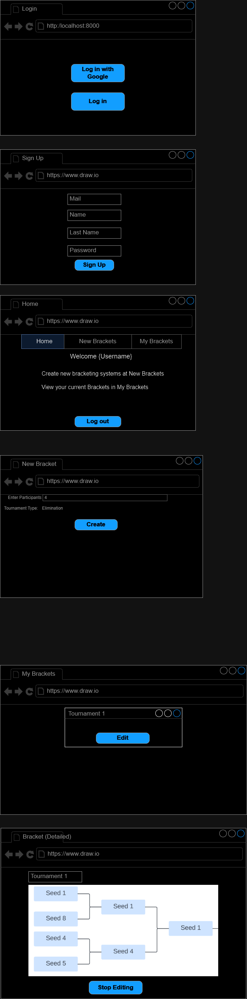

# Documentation

## Research

### Sources

- [Firebase Documentation](https://firebase.google.com/docs)
- [React Router Documentaiton](https://reactrouter.com/en/main)
- [Firestore Indexes](https://stackoverflow.com/questions/53790175/why-does-this-firestore-query-require-an-index)
- [Passing Parameters on Redirect](https://stackoverflow.com/questions/72017435/how-can-i-pass-parameters-to-route-with-navigate-function-in-react)
- [Tailwind CSS Documentation](https://tailwindcss.com/docs/installation)

### Requirements


| **Req. No.** | **Mandatory/Optional** | **Func./Qual./Margin.** | **Requirement**                                                                            |
| ------------ | ---------------------- | ----------------------- | ------------------------------------------------------------------------------------------ |
| 1            | Mandatory              | Func.                   | Login with Email and Password                                                              |
| 2            | Mandatory              | Func.                   | Registration with Email and Password                                                       |
| 3            | Mandatory              | Qual.                   | Login with OAuth (any Provider)                                                            |
| 4            | Mandatory              | Qual.                   | Registration with OAuth (any Provider)                                                     |
| 5            | Mandatory              | Func.                   | Creation of new brackets                                                                   |
| 6            | Mandatory              | Func.                   | Deletion of old brackets                                                                   |
| 7            | Mandatory              | Func.                   | Overview of all brackets that belong to the logged in user                                 |
| 8            | Optional               | Func.                   | Ability to add competitors to a bracket before start                                       |
| 9            | Optional               | Func.                   | Ability to remove competitors from a bracket before start                                  |
| 10           | Optional               | Qual.                   | Handling of uneven competitor amounts (all matches must have two competitors as opponents) |
| 11           | Mandatory              | Func.                   | Overview of all the brackets in their current state                                        |
| 12           | Optional               | Func.                   | Clicking on the winner of a match makes them advance to the next one                       |
| 13           | Optional               | Qual.                   | Correction of unstarted matches (editing outcome of parent matches)                        |
| 14           | Mandatory              | Margin.                 | Use of Firestore DB instead of Realtime DB                                                 |
| 15           | Mandatory              | Margin.                 | Use of Typescript to ensure type safety                                                    |

### Tech Stack

* Languages
    * [Typescript](https://www.typescriptlang.org/)
* Frameworks/Libraries
    * [React](https://react.dev/)
* Hosts
    * [Netlify](https://www.netlify.com/)
    * [Firebase](https://firebase.google.com/)
* Database/Backend
    * [Firestore](https://firebase.google.com/docs/firestore)

## Plan

### Work Packages


| Nr. | Due Date   | Description                                                                         | Estimated Time (in 45 min.) |
| --- | ---------- | ----------------------------------------------------------------------------------- | --------------------------- |
| 1   | 14.3.2024  | Set up repositories and GH-project                                                  | 2                           |
| 2   | 21.3.2024  | Create requirements                                                                 | 2                           |
| 3   | 21.3.2024  | Set up React project                                                                | 1                           |
| 4   | 21.3.2024  | Set up Tailwinds                                                                    | 1                           |
| 5   | 28.3.2024  | Create work packages                                                                | 3                           |
| 6   | 21.3.2024  | Configure Firebase                                                                  | 2                           |
| 7   | 21.3.2024  | Create DB schema for Firestore                                                      | 3                           |
| 8   | 28.03.2024 | Overall research                                                                    | 5                           |
| 9   | 28.03.2024 | Create UI wireframe                                                                 | 3                           |
| 10  | 28.03.2024 | Implement internal DB service for client                                            | 4                           |
| 11  | 28.03.2024 | Plan state management                                                               | 2                           |
| 12  | 25.4.2024  | Write test cases (including test env.)                                              | 3                           |
| 13  | 28.03.2024 | Implement local persistence where needed                                            | 3                           |
| 14  | 4.4.2024   | Implement login/registration pages                                                  | 2                           |
| 15  | 25.4.2024  | Implement bracket overview page (with test data)                                    | 3                           |
| 16  | 25.4.2024  | Implement bracket representation                                                    | 5                           |
| 17  | 25.4.2024  | Implement competitor management (including the clicking of winners and corrections) | 5                           |
| 18  | 25.4.2024  | Implement handling of uneven competitor amounts                                     | 5                           |
| 19  | 2.5.2024   | Test the project and document results                                               | 2                           |
| 20  | 2.5.2024   | Evaluate the project                                                                | 1                           |
| 21  | 2.5.2024   | Portfolio entry                                                                     | 3                           |

**Total Time Spent (estimate)**

Here is the calculation of how many lessons the project should take to implement. Please note, that a single lesson equals 45 minutes

```
team members: 2
total weeks: 6
lessons per week: 5
lessons per member: 6 * 5 = 35
total lessons: 30 * 2 = 60
```

**The total amount of lessons should be 60** as every one of the 2 members works 5 lessons per week over the course of 6 weeks.

### Test Cases


| Testcase-Nr. | Req.-Nr. | Preparations                                                                 | Test Environment | Input                                                                                                                                      | Predicted Output                                                                                                                   |
| ------------ | -------- | ---------------------------------------------------------------------------- | ---------------- | :----------------------------------------------------------------------------------------------------------------------------------------- | :--------------------------------------------------------------------------------------------------------------------------------- |
| 1.1          | 1        | Open[the webpage](https://bracketing.mnaray.xyz)                             | Chrome           | Enter existing credentials                                                                                                                 | Redirect to homepage                                                                                                               |
| 2.1          | 2        | Open[the webpage](https://bracketing.mnaray.xyz)                             | Chrome           | Enter new credentials                                                                                                                      | Redirect to homepage                                                                                                               |
| 3.1          | 3        | Open[the webpage](https://bracketing.mnaray.xyz)                             | Chrome           | Click on "log in with Google"                                                                                                              | Account for Google accounts selection is shown                                                                                     |
| 3.2          | 3        | 3.1                                                                          | Chrome           | Choose previously used account                                                                                                             | Redirect to homepage                                                                                                               |
| 4.1          | 4        | Open[the webpage](https://bracketing.mnaray.xyz) (also delete browser cache) | Chrome           | Click on "log in with Google"                                                                                                              | Account for Google accounts selection is shown                                                                                     |
| 4.2          | 4        | 4.1                                                                          | Chrome           | Choose new (never used to log in to the bracketing system) account                                                                         | Redirect to homepage                                                                                                               |
| 5.1          | 5        | Open[the webpage](https://bracketing.mnaray.xyz) and log in                  | Chrome           | Click on "Create Bracket" button, enter title and competitor amount (must be of the basis 2 so it works. Examples: 2, 4, 8, 16, 32, 64...) | Bracket shows up on the list of the homepage                                                                                       |
| 6.1          | 6        | 5.1                                                                          | Chrome           | Click on the red delete button                                                                                                             | Bracket to be deleted disappears                                                                                                   |
| 7.1          | 7        | Open[the webpage](https://bracketing.mnaray.xyz) and log in                  | Chrome           | Go to the /home route                                                                                                                      | Every bracket that has been created shows up                                                                                       |
| 8.1          | 8        | Open the detailed view of a bracket                                          | Chrome           | Click on "add competitor"                                                                                                                  | New competitor shows up in the bracket                                                                                             |
| 9.1          | 9        | Open the detailed view of a bracket                                          | Chrome           | Click on "remove competitor" and select the competitor to be removed                                                                       | Competitor to be removed disappears                                                                                                |
| 10.1         | 10       | Open[the webpage](https://bracketing.mnaray.xyz) and log in                  | Chrome           | Click on "Create Bracket" button, enter title and an uneven competitor amount (Examples: 5, 11, 13, 7 ...)                                 | Every competitor gets assigned to a match (noone is left out)                                                                      |
| 11.1         | 11       | Open[the webpage](https://bracketing.mnaray.xyz) and log in                  | Chrome           | Go to the /home route                                                                                                                      | Every bracket item shows data about the current state (remaining competitors, round number, current match, most recent edit, etc.) |
| 12.1         | 12       | Open the detailed view of a bracket                                          | Chrome           | Click on Competitor 1                                                                                                                      | Competitor 1 advances (visually on the screen as well)                                                                             |
| 13.1         | 13       | Open the detailed view of a bracket (12.1)                                   | Chrome           | Click on Competitor 2                                                                                                                      | Competitor 1 gets replaced by Competitor 2                                                                                         |

#### Testenvironment

  **Chrome (for PDFs und Documentation)**
  **Chrome (for PDFs und Documentation)**
- Version 122.0.6261.58 (Official Build) (64-bit)
**Chrome (for PDFs und Documentation)**
- Version 122.0.6261.58 (Official Build) (64-bit)

- Version 124.0.6367.92 (Official Build) (64-bit)

### DB schema for Firestore

Due to Firestore being a No-SQL database, we had to come up with a schema that can still represent relation to some extent. This was of great importance because to the bracket structure, which essentialy is a binary tree.

This is the schema we will be using for the brackets:

* root/
    * etc.../
    * brackets/
        * bracketId/
            * title: string
            * createdAt: int
            * editedAt: int
            * ownerName: string *(username)*
            * started: bool
            * startedAt: int
            * rounds: **IRound[]**


**Interfaces:**

* IRound:
    * roundNumber: int
    * matches: **IMatch[]**
* IMatch:
    * id: string
    * competitor1: **ICompetitor**
    * competitor2: **ICompetitor**
    * winner: **ICompetitor** | undefined
    * started: bool
    * nextMatch: string | undefined
* ICompetitor:
    * name: string *(must be unique in the bracket)*
    * previousMatchId: string | undefined

### Simple UI wireframe



## Decide

### Database Type and Engine

At the very beginning of the project we were thinking about using a realtime NoSQL database such as [Firebase](https://firebase.google.com/docs/database) to avoid having to deal with failed transactions. That would have worked by attaching observers to certain nodes (JSON elements) in the database and subscribing them to update events.

However, we decided to go with a relational database in the end, so that we can avoid redundancy. Our final decision on this subject came down to [Microsoft SQL Server 2022 Express](https://www.microsoft.com/de-de/download/details.aspx?id=104781). We chose that engine due to its range of feature and our experience with it.

### Database Hosting

### Documentation Site

In terms of hosting the documentation there were interesting discussions as well. They were mostly about whether we should stay with [Docusaurus](https://docusaurus.io/) (a technology we all know from previous projects) or if we should try out something new as an alternative. This is due to Docusaurus being a struggle to fully integrate and automate with GitHub-Pages.

As a replacement we found several other tools. Most of them were sadly even less convenient or just overly complicated compared to docusaurus. One of the top candidates was [Sphinx](https://www.sphinx-doc.org/en/master/), but it uses a very odd syntax over the regular Markdown everyone in the team is used to.

When looking for a potential host for it we found [Read the Docs](https://about.readthedocs.com/?ref=readthedocs.com). It can even fully automate previews and deployments from a GitHub repository by simply setting up a Webhook in it. This feature spared us the creation of a dedicated workflow and the debugging of it, which took a good while with Docusaurus originally. So this is the host we went with for the documentation, instead of GitHub-Pages.

While skimming through the documentation of the new host, we found out that it also works with a Markdown based framework called [MkDocs](https://www.mkdocs.org/). After reading up a bit on MkDoc's customization possibilities we found the [Material Theme for MkDocs by Squidfunk](https://squidfunk.github.io/mkdocs-material/) to be suitable for our needs. It provides more or less the same features as Docusaurus, just without the complications we had. As so, our final decision regarding the documentation side of things was to use MkDocs with the Material Theme and host it on Read the Docs.

### Linting and Linters

We opted to use [ESLint]() to keep the code evenly styled. The reason for our decision being, that we did not want to waste time on doing more research on linters that we don't know how to deal with. Both team members know how ESLint works so it was the optimal tool for this scenario.

## Realise

### Achitecture

### Execution Table

### Execution Table

This is the table that shows the actual time it took to fully implement the project.


| Nr. | Due Date | Description | Actual Time | Estimated Time (45 min.) |
| --- | -------- | ----------- | ----------- | ------------------------ |
|     |          |             |             |                          |

## Control

### Test Protocol


| Test-Nr. | Note | Result | Date | Signature |
| -------- | ---- | ------ | ---- | --------- |
|          |      |        |      |           |

### Conclusion

## Evaluate
